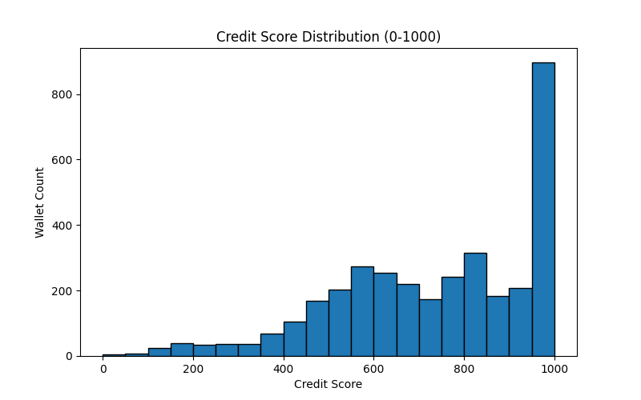

# Credit Score Analysis

## Score Distribution

| Score Range   | Wallet Count |
|---------------|--------------|
| 0–100         | 12           |
| 100–200       | 64           |
| 200–300       | 72           |
| 300–400       | 104          |
| 400–500       | 279          |
| 500–600       | 475          |
| 600–700       | 477          |
| 700–800       | 416          |
| 800–900       | 509          |
| 900–1000      | 1089         |

---

## Behavioral Analysis

### **Low Score Wallets (0–200)**
- **Common behaviors:**
  - Frequent liquidations or failed repayments
  - Very short loan durations (bot-like)
  - High percentage of rapid, repetitive transactions
  - Low asset diversity (single-asset usage)
- **Interpretation:**  
  These wallets are likely bots, exploiters, or high-risk users with poor protocol engagement.

### **Mid Score Wallets (400–700)**
- **Common behaviors:**
  - Moderate activity and engagement
  - Some risk signals, but not extreme
  - Occasional liquidations or missed repayments

### **High Score Wallets (800–1000)**
- **Common behaviors:**
  - Consistent repayments, no liquidations
  - Long wallet age and high activity
  - High asset diversity and stablecoin usage
  - Human-like transaction patterns (regular intervals, longer loan holding)
- **Interpretation:**  
  These wallets are likely responsible, long-term users with strong protocol engagement and low risk.

---

## Insights

- The majority of wallets cluster at the high end, reflecting many responsible users.
- A significant tail of low-score wallets highlights the presence of bots, exploiters, or risky actors.
- The model is robust to outliers and captures a wide range of user behaviors.

---

## Next Steps

- Further refine features or model as new data becomes available.
- Use score thresholds for protocol risk management or user incentives.

---
